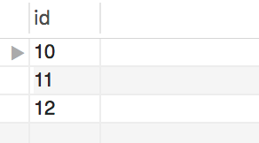

# Joins Are From Descartes, Rows Are From Schemas


### Part 1

* The outputs of following queries are 25 and 10, respectively. 

  ```sql
  SELECT COUNT(*)
  FROM first_table;
  
  SELECT COUNT(*)
  FROM second_table;
  ```
  
* What will be the number of rows in the output of the following query?

  ```sql
  SELECT *
  FROM first_table, second_table;
  ```  

--There will be 35 rows in the output of this query.
  
### Part 2

* The query `SELECT * FROM table_one;` returns the following:

  
  
* And the query `SELECT * FROM table_two;` returns the following:

  

* What will the query `SELECT * FROM table_one, table_two;` look like?

--It will return two columns with the header 'id' and seven rows.
