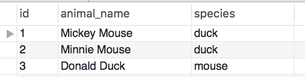

# The Thrill of the Case

* Change each animal's species to the correct species.

  

  UPDATE case01
  SET  species = 'mouse'
  WHERE animal_name LIKE '%Mouse';

  UPDATE case01
  SET species = 'duck'
  WHERE animal_name LIKE '%Duck'

